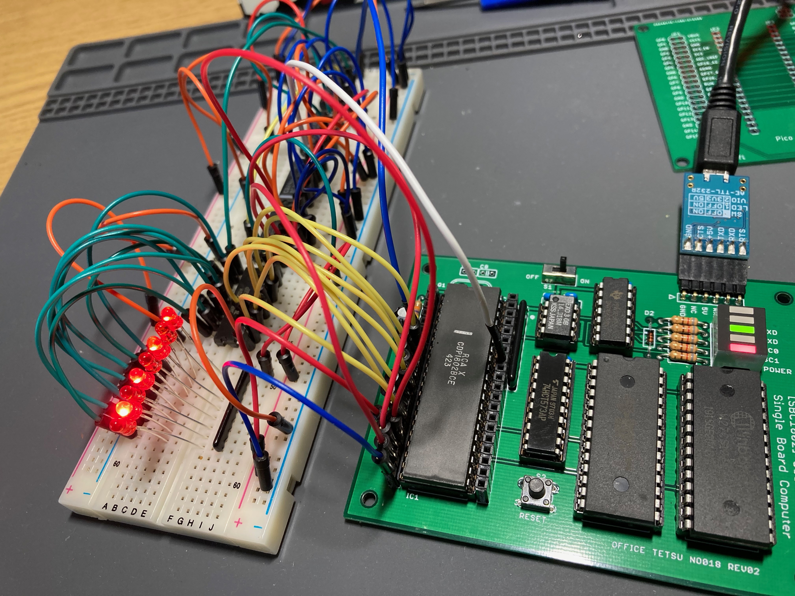
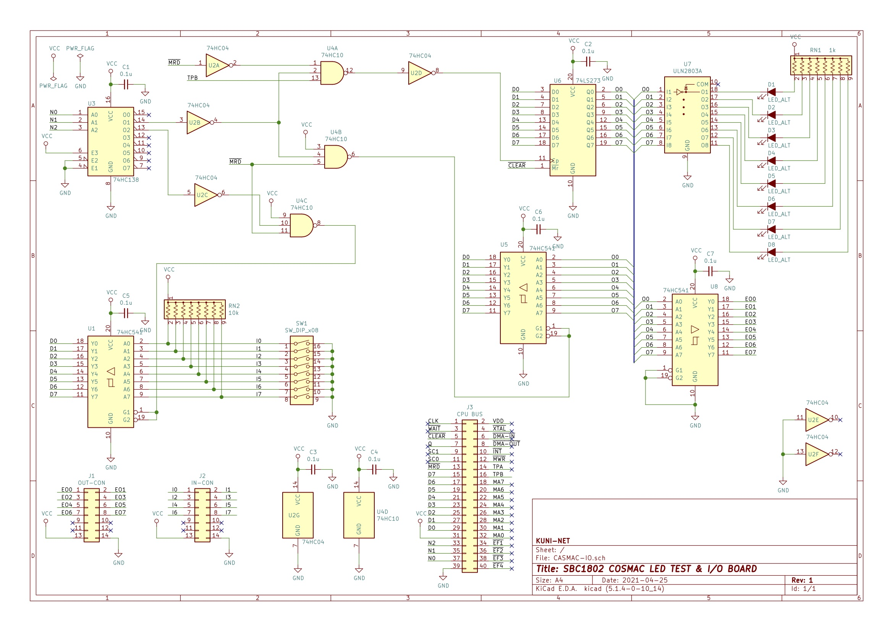

# SBC1802 LEDテスト & I/Oボード

## 概要

* SBC1802 COSMACシングルボードコンピューターのBASICのOUT命令でLEDをチカチカする
* DIPスイッチでBASICのINP関数で入力をテストすることができる。



## 回路図



## BASICでの試し方

### 出力

```
OUT (0,1,$AA)
OUT (0,1,$55)
```

### 入力

```
A=INP(0,2):PRINT A
```

## 参考

* SBC1802技術資料
    * http://www.amy.hi-ho.ne.jp/officetetsu/storage/sbc1802\_techdata.pdf
* COSMAC研究会
    * https://kanpapa.com/cosmac/
